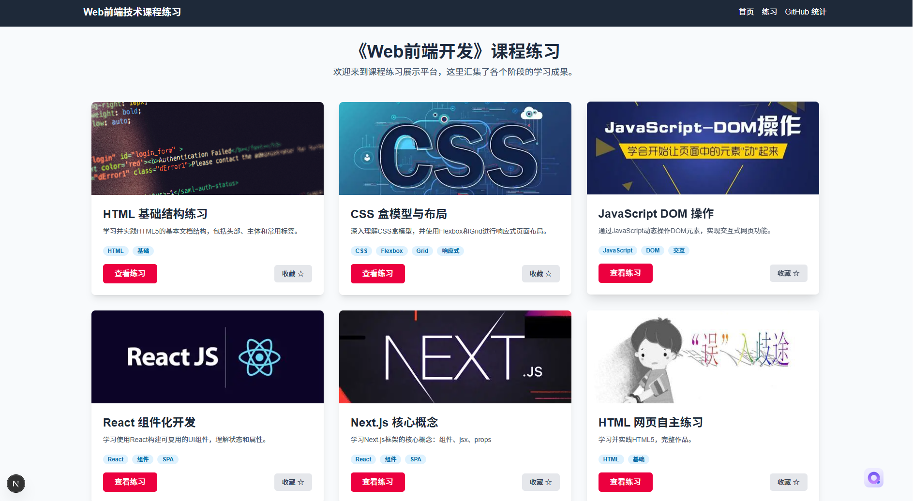
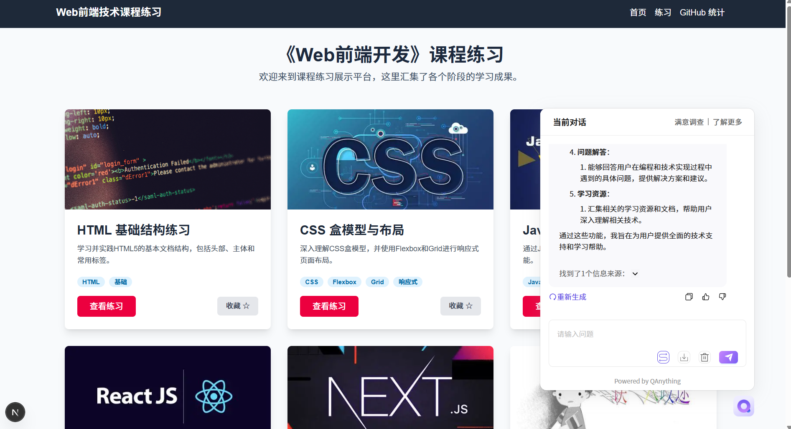
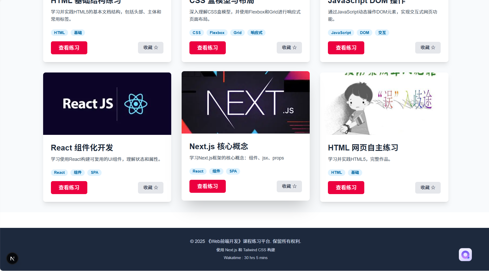
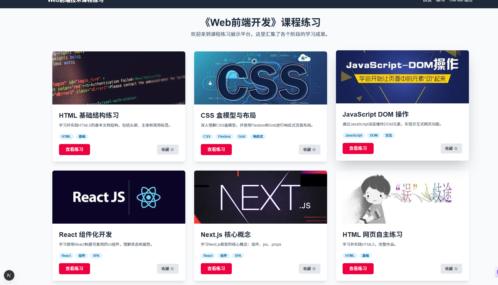

### 项目简介

该项目是《Web 前端开发》课程的综合实践成果展示平台，采用 Next.js 框架构建了两个核心应用my-next-app与tailwind-app，旨在系统性呈现从基础到进阶的前端技术学习轨迹。项目以模块化结构整合了 HTML、CSS、JavaScript、React 及 Next.js 等技术栈的实战练习，同时集成 QAnything 智能问答工具与 WakaTime 开发数据统计功能，形成兼具学习展示与效率管理的复合型前端应用。



### QAnything集成路径与实现细节

#### 集成路径

我选择直接在 Next.js 应用中通过 iframe 嵌入QAnything提供的现有HTML问答页面。在`tailwind-app`项目的`src/app/layout.js`文件中，通过`<script>`标签引入QAnything的脚本，并配置相关参数实现集成。

#### 实现细节

```javascript
// tailwind-app/src/app/layout.js
<script
  src="https://ai.youdao.com/saas/qanything/js/agent-iframe-min.js"
  id="qanything-iframe"
  data-agent-src="https://ai.youdao.com/saas/qanything/#/bots/88A40C6A9F9C4C38/share"
  data-open-icon="https://download.ydstatic.com/ead/icon-qanything-iframe-btn.png"
  data-close-icon="https://download.ydstatic.com/ead/icon-qanything-iframe-btn.png"
  defer
>
</script>
```
- 选择路径及原因：使用QAnything创建知识库，将知识库关联到Agents，进行发布，嵌入网页选择复制链接，写入相应的代码文件中。
选择在`layout.js`中集成QAnything是因为`layout.js`是Next.js应用的全局布局文件，所有页面都会共享该布局。这样可以确保在整个应用的所有页面中都能使用QAnything的问答功能，无需在每个页面单独引入。



### WakaTime API集成方法

1. 创建 Cloudflare Worker 项目
2. 编写 Worker 逻辑以获取 Wakatime 数据
3. 配置并部署 Cloudflare Worker
4. 在 Next.js 中创建或修改 Footer 组件
5. 在 Footer 组件中调用 Worker API 并显示数据
  // 请将 'YOUR_WORKER_URL' 替换为您实际部署的 Cloudflare Worker URL
        const workerUrl = "http://mlf-wakatime.wemedia.press/";
        const response = await fetch(workerUrl);

        if (!response.ok) {
          const errorData = await response
            .json()
            .catch(() => ({ message: "Failed to parse error response" }));
          throw new Error(
            errorData.message ||
              `Error fetching Wakatime stats: ${response.status}`
          );
        }



### Next.js项目结构

#### 项目结构

 1. HTML 基础：包含文档结构、语义化标签、表单设计等基础练习
 2. CSS 进阶：涵盖布局方案、动画效果、响应式设计等高级应用
 3. JavaScript 核心：聚焦 DOM 操作、事件处理、异步编程等核心概念
 4. React 实战：从基础组件到状态管理、生命周期等 React 特性实践
 5. Next.js 应用：服务器端渲染、路由优化、API 路由等框架特性演练



#### `my-next-app`

- `src`目录：包含应用的主要源代码。
  - `app`目录：Next.js的App Router目录，包含页面组件。
    - `page.js`：首页组件。
  - `components`目录：包含可复用的组件。
    - `HomeworkCard.js`：作业卡片组件。
- `jsconfig.json`：JavaScript配置文件，用于路径映射。
- `package.json`：项目依赖和脚本配置文件。

#### `tailwind-app`

- `src`目录：包含应用的主要源代码。
  - `app`目录：Next.js的App Router目录，包含页面组件。
    - `page.js`：首页组件，展示练习卡片。
    - `github-stats`目录：包含GitHub提交统计相关页面。
      - `page.js`：展示GitHub提交记录。
      - `commits`目录：包含提交详情页面。
        - `[commitId]`目录：动态路由目录，展示特定提交的详情。
          - `page.js`：提交详情页面组件。
  - `components`目录：包含可复用的组件。
  - `data`目录：包含练习数据的JSON文件。
    - `exercises.json`：练习数据文件。
- `public`目录：包含静态资源和练习的HTML文件。
  - `exercises`目录：包含各种练习的HTML文件。
- `package.json`：项目依赖和脚本配置文件。


### 旧作业整合方式

为了统一管理旧作业，在项目的`public`目录下新建`exercises`文件夹，并将所有作业的HTML文件移动到该文件夹中。例如，在`tailwind-app`项目中已经存在`public/exercises`目录，将相关的HTML文件（如`week01.html`、`javaScript(1).html`等）放在该目录下，并在`src/data/exercises.json`文件中更新练习的链接。

.jpg)

```json
// tailwind-app/src/data/exercises.json
[
  {
    "id": 1,
    "title": "HTML 基础结构练习",
    "description": "学习并实践HTML5的基本文档结构，包括头部、主体和常用标签。",
    "imageUrl": "https://images.unsplash.com/photo-1600695268275-1a6468700bd5",
    "link": "/exercises/week01.html",
    "tags": [
      "HTML",
      "基础"
    ]
  },
  // 其他练习项..
]
```
### 自主创建项目

充分利用课程所学知识，自主设计与未成年犯罪相关的网页

.jpg)

### 项目运行指南

#### 启动开发服务器

1. 进入项目目录：
   - 对于`my-next-app`：
     ```bash
     cd Web-Malianfang/my-next-app
     ```
   - 对于`tailwind-app`：
     ```bash
     cd Web-Malianfang/tailwind-app
     ```
2. 安装依赖：
   ```bash
   npm install
   ```
3. 启动开发服务器：
   ```bash
   npm run dev
   ```
4. 打开浏览器：访问 [http://localhost:3000](http://localhost:3000) （CTRL+单击）查看应用。